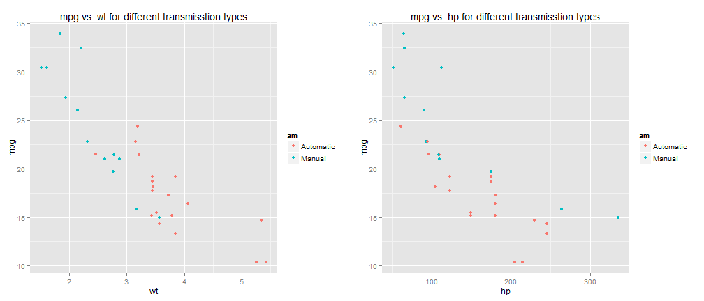

## What does this app do?

1. Predicting car's efficiency
2. How many miles per gallon the car runs?
3. This can be predicted from car's Weight, Transmission type and hp
4. Uses historical data to build a regression model to understand and predict

__A note for car buyer: Know car's efficiency before deciding to buy__

--- .class #id 

## Using historical data to build a model

Using _mtcars_ data and only wt, hp and am columns


```r
head( mtcars[ ,c( "mpg", "wt", "hp", "am")] )
```

```
##                    mpg    wt  hp        am
## Mazda RX4         21.0 2.620 110    Manual
## Mazda RX4 Wag     21.0 2.875 110    Manual
## Datsun 710        22.8 2.320  93    Manual
## Hornet 4 Drive    21.4 3.215 110 Automatic
## Hornet Sportabout 18.7 3.440 175 Automatic
## Valiant           18.1 3.460 105 Automatic
```

--- .class #id 

## Exploring relationships 

 

From the plots, mpg seems to be negatively correlated with wt and hp. Also, manual transmission have higher mpg compared to automatic transmission types. 

--- .class #id 

## Building the regression model 


```r
fit1 <- lm( mpg ~ wt + hp + am, data = mtcars )
fit1$coefficients
```

```
## (Intercept)          wt          hp    amManual 
##    34.00288    -2.87858    -0.03748     2.08371
```

--- .class #id 

## Using the app to predict miles per gallon

Access the application using the url 
[http://manaranjanp.shinyapps.io/predictmpg](http://manaranjanp.shinyapps.io/predictmpg)


